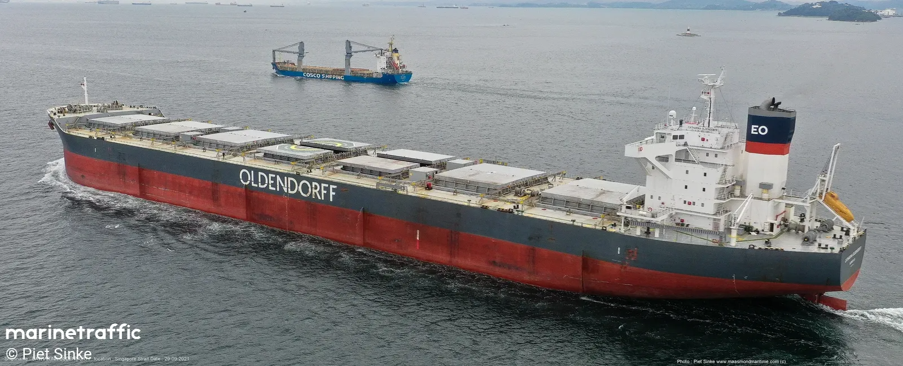

# Draft Survey Calculator
Vessel calculation created based on Panamax vessel, but can be changed for another vessel, by replacing hydrostatic data inside script.js -> led data.

## Overview

This repository contains a draft survey calculator, which is a tool used to estimate the quantity of cargo loaded or discharged on a vessel based on changes in its draft. The draft survey is a crucial process for ensuring the vessel's stability, compliance with weight regulations, and safety during loading and unloading operations.

## What is a Draft Survey?

A draft survey is a method used to determine the quantity of bulk cargo loaded or discharged from a vessel by measuring the changes in its draft (the depth from the waterline to the keel) before and after loading or unloading operations. This calculation is essential for commercial purposes, ensuring accurate invoicing, as well as for safety reasons to prevent overloading and maintain the vessel's stability.

## Draft Survey Calculator

The draft survey calculator provided in this repository is designed to streamline the process of calculating cargo quantities based on draft measurements. It takes input data such as initial and final draft readings, vessel particulars, and cargo density, and produces accurate estimates of cargo quantities.

### Features

- Input fields for initial and final draft readings
- Calculation of cargo quantity based on draft measurements
- Customizable vessel particulars and water density
- User-friendly interface for easy data entry and calculation

## Getting Started

To use the draft survey calculator, follow these steps:

1. Clone or download this repository to your local machine.
2. Open the draft survey calculator file in your preferred environment (Google Chrome).
3. Input the required data, including initial and final draft readings, vessel particulars, and cargo density.
4. Run the calculation to obtain the estimated cargo quantity.

## Contributing

Contributions to this project are welcome! If you have any suggestions, bug fixes, or additional features to propose, feel free to open an issue or submit a pull request. Your contributions help improve the functionality and usability of the draft survey calculator for all users.

## Acknowledgements

Special thanks to [MarineTraffic](https://www.marinetraffic.com/) for providing the image used in this README.

